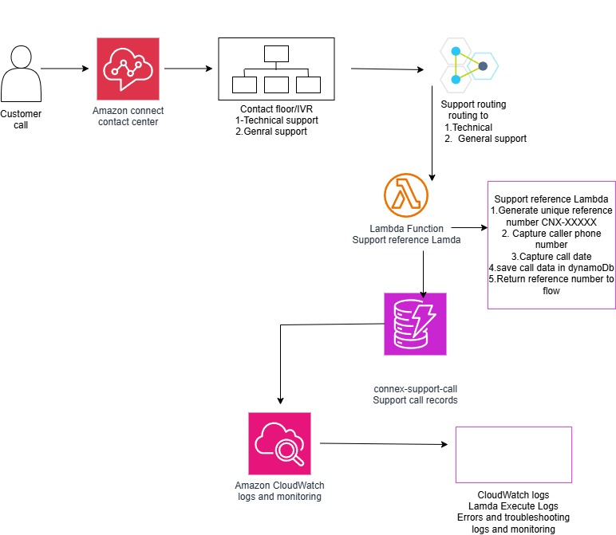

# Amazon Connect Serverless Support

A serverless customer support contact center built with Amazon Connect, AWS Lambda, Amazon DynamoDB, Amazon CloudWatch, and AWS IAM.

## Project Overview

This project demonstrates a serverless customer support workflow built on AWS.

Customers call an Amazon Connect contact center and interact with an IVR to select the type of assistance they need:

- Press 1 for Technical Support
- Press 2 for General Support

Based on the customer's selection, Amazon Connect routes the call to the appropriate support queue.

During the interaction, Amazon Connect invokes an AWS Lambda function that creates a unique support reference number, captures call information, and stores the support ticket in Amazon DynamoDB.

The reference number is returned to Amazon Connect and announced to the caller before the call is transferred to a support agent.

Amazon CloudWatch provides Lambda execution logging and troubleshooting.

## Call Flow

```text
Customer Call
      ↓
Amazon Connect
      ↓
Welcome Prompt
      ↓
IVR - Choose Support Type
      ↓
 ┌──────────────┴──────────────┐
 ↓                             ↓
Press 1                       Press 2
Technical Support             General Support
 ↓                             ↓
Technical Queue               General Queue
 └──────────────┬──────────────┘
                ↓
AWS Lambda
                ↓
Generate CNX Reference
                ↓
Create Support Ticket
                ↓
Amazon DynamoDB
                ↓
Return Reference to Amazon Connect
                ↓
Announce Reference Number
                ↓
Transfer to Support Queue
                ↓
Support Agent
```

## Features

- Amazon Connect cloud contact center
- Interactive Voice Response (IVR)
- Technical Support and General Support selection
- Queue-based call routing
- AWS Lambda integration with Amazon Connect
- Automatic support ticket/reference generation
- Unique `CNX-XXXXXX` reference numbers
- Caller phone number capture
- Amazon Connect Contact ID capture
- Support type tracking
- Ticket status tracking
- Call creation timestamp
- DynamoDB support ticket storage
- Dynamic reference number returned to Amazon Connect
- Reference number announced to the caller
- CloudWatch execution logging and troubleshooting
- IAM-based Lambda permissions for DynamoDB access

## AWS Services Used

| Service | Purpose |
|---|---|
| Amazon Connect | Contact center, IVR, queues, and call routing |
| AWS Lambda | Generates support references and processes call data |
| Amazon DynamoDB | Stores support ticket and call information |
| Amazon CloudWatch | Lambda execution logs and troubleshooting |
| AWS IAM | Controls Lambda access to DynamoDB and other AWS resources |

## Support Reference Lambda

The Lambda function is invoked by the Amazon Connect contact flow.

It generates a unique six-digit support reference:

```text
CNX-575713
```

The function captures and stores:

- Support reference number
- Amazon Connect Contact ID
- Caller phone number
- Support type
- Ticket status
- Creation timestamp

A support ticket can therefore look like:

```text
referencenumber: CNX-575713
contactId: xxxxxxxx-xxxx-xxxx-xxxx-xxxxxxxxxxxx
callernumber: +1XXXXXXXXXX
supportType: Technical
status: OPEN
createdate: 2026-08-27T19:30:00.000Z
```

The Lambda function then returns the generated reference number to Amazon Connect so that it can be announced to the caller.

## Monitoring and Troubleshooting

Amazon CloudWatch captures Lambda execution logs.

The logs provide visibility into:

- Amazon Connect events received by Lambda
- Generated support reference numbers
- DynamoDB write operations
- Successful Lambda executions
- Runtime errors and failed operations

Example:

```text
Amazon Connect event received
Generated reference: CNX-575713
Saved support ticket: CNX-575713
```

## Repository Structure

```text
amazon-connect-serverless-support/
│
├── lambda/
│   └── support-reference/
│       └── index.mjs
│
├── architecture2.jpg
├── .gitignore
├── LICENSE
└── README.md
```

## Architecture



## Skills Demonstrated

- Amazon Connect
- AWS Lambda
- Amazon DynamoDB
- Amazon CloudWatch
- AWS IAM
- Node.js / JavaScript
- Serverless Architecture
- IVR Development
- Contact Flow Design
- Queue-Based Call Routing
- AWS SDK for JavaScript
- Cloud Troubleshooting

## Future Improvements

- Add ticket status updates after agent interactions
- Add customer authentication
- Add automated ticket notifications
- Add CloudWatch alarms and operational metrics
- Provision infrastructure using Terraform
- Add CI/CD for Lambda deployments
